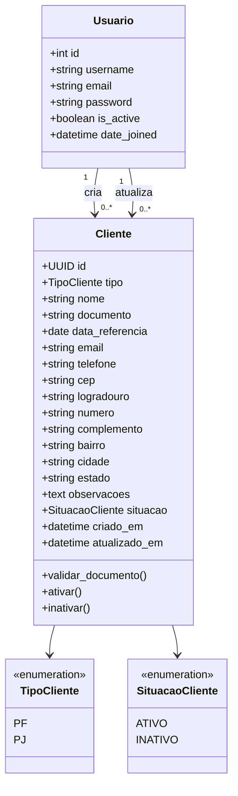
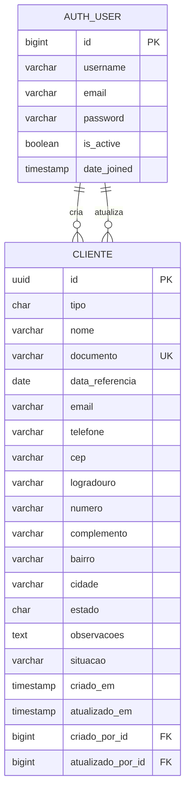
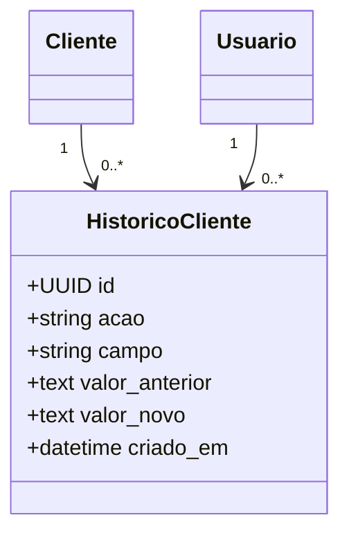

# Skill — Modelagem de Dados do Sistema de Clientes

## 1. Objetivo

Este documento define a modelagem de dados do sistema de cadastro de clientes Pessoa Física e Pessoa Jurídica.

A modelagem foi criada para atender:

- cadastro de clientes PF e PJ;
- autenticação pelo Django;
- pesquisa;
- edição;
- ativação e inativação;
- dashboard;
- relatórios;
- auditoria básica;
- privacidade;
- integração com PostgreSQL no Supabase;
- uso do Django ORM e migrations.

---

## 2. Decisões de Modelagem

### 2.1 Uma única entidade para PF e PJ

Pessoa Física e Pessoa Jurídica serão armazenadas na mesma entidade:

```text
Cliente
```

A diferenciação será feita pelo campo:

```text
tipo
```

Valores permitidos:

- `PF`;
- `PJ`.

Essa decisão evita:

- duplicação de tabelas;
- duplicação de regras;
- pesquisas separadas;
- relatórios mais complexos;
- manutenção desnecessária.

---

### 2.2 Um único campo para nome

O banco utilizará:

```text
nome
```

Na interface:

- PF: Nome completo;
- PJ: Nome empresarial.

---

### 2.3 Um único campo para documento

O banco utilizará:

```text
documento
```

Na interface:

- PF: CPF;
- PJ: CNPJ.

O documento será armazenado apenas com números.

Exemplos:

```text
CPF: 12345678900
CNPJ: 12345678000199
```

A máscara será aplicada apenas na interface.

---

### 2.4 Um único campo para data

O banco utilizará:

```text
data_referencia
```

Na interface:

- PF: Data de nascimento;
- PJ: Data de abertura.

O campo será opcional.

---

### 2.5 Endereço dentro da entidade Cliente

Na primeira versão, o endereço será armazenado diretamente na entidade `Cliente`.

Não será criada uma tabela separada de endereços porque:

- haverá apenas um endereço por cliente;
- o sistema inicial é simples;
- não existe necessidade atual de múltiplos endereços;
- reduz complexidade de consultas e formulários.

Caso o sistema futuramente precise de endereço comercial, residencial, cobrança ou entrega, a modelagem poderá evoluir para uma entidade própria.

---

### 2.6 Inativação no lugar de exclusão

O cadastro terá um campo de situação:

- `ATIVO`;
- `INATIVO`.

A exclusão física do registro não será a operação padrão.

Essa decisão preserva:

- histórico;
- relatórios;
- integridade dos dados;
- rastreabilidade.

---

## 3. Entidades da Primeira Versão

A primeira versão possuirá duas entidades principais:

1. `Usuario`;
2. `Cliente`.

A entidade `Usuario` será fornecida pelo sistema de autenticação do Django.

A entidade `Cliente` será criada pelo projeto.

---

## 4. Diagrama UML de Classes



---

## 5. Diagrama Entidade-Relacionamento



---

## 6. Entidade Cliente

### 6.1 Finalidade

Representar uma Pessoa Física ou Pessoa Jurídica cadastrada no sistema.

---

## 7. Dicionário de Dados

| Campo | Tipo lógico | Tipo Django sugerido | PostgreSQL | Tamanho | Obrigatório | Regra |
|---|---|---|---|---:|---|---|
| `id` | Identificador | `UUIDField` | `uuid` | — | Sim | Chave primária |
| `tipo` | Enumeração | `CharField` | `varchar(2)` | 2 | Sim | `PF` ou `PJ` |
| `nome` | Texto | `CharField` | `varchar(200)` | 200 | Sim | Nome completo ou empresarial |
| `documento` | Texto numérico | `CharField` | `varchar(14)` | 14 | Sim | CPF ou CNPJ, somente números |
| `data_referencia` | Data | `DateField` | `date` | — | Não | Nascimento ou abertura |
| `email` | E-mail | `EmailField` | `varchar(254)` | 254 | Não | Formato válido |
| `telefone` | Texto numérico | `CharField` | `varchar(11)` | 11 | Sim | DDD + telefone |
| `cep` | Texto numérico | `CharField` | `varchar(8)` | 8 | Sim | Somente números |
| `logradouro` | Texto | `CharField` | `varchar(200)` | 200 | Não | Rua, avenida etc. |
| `numero` | Texto | `CharField` | `varchar(20)` | 20 | Não | Aceita números e valores como `S/N` |
| `complemento` | Texto | `CharField` | `varchar(100)` | 100 | Não | Sala, bloco, apartamento etc. |
| `bairro` | Texto | `CharField` | `varchar(100)` | 100 | Não | Bairro |
| `cidade` | Texto | `CharField` | `varchar(100)` | 100 | Não | Município |
| `estado` | UF | `CharField` | `varchar(2)` | 2 | Não | Sigla válida |
| `observacoes` | Texto longo | `TextField` | `text` | — | Não | Informações complementares |
| `situacao` | Enumeração | `CharField` | `varchar(7)` | 7 | Sim | `ATIVO` ou `INATIVO` |
| `criado_em` | Data e hora | `DateTimeField` | `timestamptz` | — | Sim | Automático |
| `atualizado_em` | Data e hora | `DateTimeField` | `timestamptz` | — | Sim | Automático |
| `criado_por` | Relacionamento | `ForeignKey` | `bigint` | — | Não | Usuário criador |
| `atualizado_por` | Relacionamento | `ForeignKey` | `bigint` | — | Não | Último usuário que atualizou |

---

## 8. Chave Primária

A chave primária será:

```text
id
```

Tipo sugerido:

```text
UUID
```

Exemplo:

```text
2c20c0f8-7b13-45d5-9b43-f1ea44d58e28
```

### Justificativa

- não expõe sequência numérica;
- funciona bem em integrações futuras;
- reduz dependência de identificadores incrementais;
- é suportado pelo Django e PostgreSQL;
- facilita migrações e sincronizações futuras.

---

## 9. Enumeração Tipo de Cliente

```text
PF = Pessoa Física
PJ = Pessoa Jurídica
```

Representação sugerida no Django:

```python
class TipoCliente(models.TextChoices):
    PF = "PF", "Pessoa Física"
    PJ = "PJ", "Pessoa Jurídica"
```

---

## 10. Enumeração Situação

```text
ATIVO
INATIVO
```

Representação sugerida no Django:

```python
class SituacaoCliente(models.TextChoices):
    ATIVO = "ATIVO", "Ativo"
    INATIVO = "INATIVO", "Inativo"
```

Valor padrão:

```text
ATIVO
```

---

## 11. Regras de Integridade

### 11.1 Tipo obrigatório

O campo `tipo` deverá aceitar somente:

```text
PF
PJ
```

---

### 11.2 Nome obrigatório

O campo `nome` deverá:

- possuir pelo menos 3 caracteres úteis;
- ter espaços laterais removidos;
- ter espaços duplicados normalizados;
- não aceitar somente números;
- não aceitar somente símbolos.

---

### 11.3 Documento obrigatório e único

O campo `documento` deverá:

- conter somente números;
- ser obrigatório;
- ser único;
- possuir 11 dígitos para PF;
- possuir 14 dígitos para PJ;
- passar pela validação dos dígitos verificadores.

Regra conceitual:

```text
SE tipo = PF
ENTÃO documento deve possuir 11 dígitos e ser um CPF válido

SE tipo = PJ
ENTÃO documento deve possuir 14 dígitos e ser um CNPJ válido
```

---

### 11.4 Telefone obrigatório

O telefone deverá:

- conter somente números no banco;
- possuir DDD;
- possuir 10 ou 11 dígitos;
- aceitar telefone fixo ou celular.

---

### 11.5 CEP obrigatório

O CEP deverá:

- conter somente números;
- possuir exatamente 8 dígitos;
- ser obrigatório;
- não depender da disponibilidade do serviço externo para ser salvo.

---

### 11.6 E-mail opcional

Quando informado:

- deverá possuir formato válido;
- deverá ser convertido para letras minúsculas;
- deverá ter espaços removidos.

O e-mail não será único.

---

### 11.7 Data de referência

Quando informada:

- não poderá estar no futuro;
- deverá ser uma data válida.

---

### 11.8 Estado

Quando informado:

- deverá possuir 2 caracteres;
- deverá corresponder a uma UF válida;
- deverá ser armazenado em letras maiúsculas.

---

### 11.9 Situação

A situação deverá aceitar somente:

```text
ATIVO
INATIVO
```

Todo novo cliente será criado como:

```text
ATIVO
```

---

## 12. Restrições de Banco

### 12.1 Chave primária

```text
PRIMARY KEY (id)
```

### 12.2 Documento único

```text
UNIQUE (documento)
```

### 12.3 Tipo válido

```text
CHECK tipo IN ('PF', 'PJ')
```

### 12.4 Situação válida

```text
CHECK situacao IN ('ATIVO', 'INATIVO')
```

### 12.5 Tamanho do documento conforme tipo

Regra lógica:

```text
(tipo = 'PF' AND length(documento) = 11)
OR
(tipo = 'PJ' AND length(documento) = 14)
```

### 12.6 CEP

Regra lógica:

```text
length(cep) = 8
```

### 12.7 Telefone

Regra lógica:

```text
length(telefone) IN (10, 11)
```

A validação dos dígitos verificadores de CPF e CNPJ deverá ocorrer principalmente na aplicação Django.

---

## 13. Índices

### 13.1 Índice único de documento

```text
documento
```

Finalidade:

- impedir duplicidade;
- acelerar busca por CPF ou CNPJ.

---

### 13.2 Índice de nome

```text
nome
```

Finalidade:

- ordenação alfabética;
- pesquisa;
- relatórios.

---

### 13.3 Índice de telefone

```text
telefone
```

Finalidade:

- pesquisa direta;
- detecção de possível duplicidade.

---

### 13.4 Índice de e-mail

```text
email
```

Finalidade:

- pesquisa;
- detecção de possível duplicidade.

---

### 13.5 Índice de tipo

```text
tipo
```

Finalidade:

- filtros PF e PJ;
- dashboard;
- relatórios.

---

### 13.6 Índice de situação

```text
situacao
```

Finalidade:

- filtros;
- contagem de ativos e inativos.

---

### 13.7 Índice composto de localização

```text
estado, cidade
```

Finalidade:

- pesquisa por localidade;
- rankings;
- relatórios por estado e cidade.

---

### 13.8 Índice de criação

```text
criado_em
```

Finalidade:

- relatórios por período;
- clientes recentes;
- dashboard.

---

### 13.9 Índice de atualização

```text
atualizado_em
```

Finalidade:

- clientes atualizados recentemente;
- relatórios por atualização.

---

## 14. Relacionamentos com Usuário

### 14.1 Criado por

```text
Cliente.criado_por -> Usuario
```

Cardinalidade:

```text
Um usuário pode criar vários clientes.
Um cliente pode ter um usuário criador.
```

O campo poderá aceitar valor nulo para:

- importações;
- migrações;
- registros administrativos;
- compatibilidade com dados antigos.

---

### 14.2 Atualizado por

```text
Cliente.atualizado_por -> Usuario
```

Cardinalidade:

```text
Um usuário pode atualizar vários clientes.
Um cliente pode registrar o último usuário que o atualizou.
```

---

## 15. Auditoria da Primeira Versão

A auditoria inicial terá:

- data de criação;
- data da última atualização;
- usuário criador;
- último usuário que atualizou.

Não será criado inicialmente um histórico completo de cada alteração.

---

## 16. Evolução Futura de Auditoria

Caso seja necessário registrar todas as mudanças, poderá ser criada a entidade:

```text
HistoricoCliente
```

Campos possíveis:

- id;
- cliente;
- usuário;
- data e hora;
- ação;
- campo alterado;
- valor anterior;
- valor novo.

Diagrama futuro:



Essa entidade não faz parte obrigatória do MVP.

---

## 17. Estrutura Lógica da Tabela

```text
CLIENTE
--------------------------------------------------
id                      UUID               PK
tipo                    VARCHAR(2)         NOT NULL
nome                    VARCHAR(200)       NOT NULL
documento               VARCHAR(14)        NOT NULL UNIQUE
data_referencia         DATE               NULL
email                   VARCHAR(254)       NULL
telefone                VARCHAR(11)        NOT NULL
cep                     VARCHAR(8)         NOT NULL
logradouro              VARCHAR(200)       NULL
numero                  VARCHAR(20)        NULL
complemento             VARCHAR(100)       NULL
bairro                   VARCHAR(100)       NULL
cidade                  VARCHAR(100)       NULL
estado                  VARCHAR(2)         NULL
observacoes             TEXT               NULL
situacao                VARCHAR(7)         NOT NULL DEFAULT 'ATIVO'
criado_em               TIMESTAMPTZ        NOT NULL
atualizado_em           TIMESTAMPTZ        NOT NULL
criado_por_id           BIGINT             NULL FK
atualizado_por_id       BIGINT             NULL FK
```

---

## 18. Esboço do Modelo Django

```python
import uuid

from django.conf import settings
from django.db import models


class Cliente(models.Model):
    class TipoCliente(models.TextChoices):
        PF = "PF", "Pessoa Física"
        PJ = "PJ", "Pessoa Jurídica"

    class SituacaoCliente(models.TextChoices):
        ATIVO = "ATIVO", "Ativo"
        INATIVO = "INATIVO", "Inativo"

    id = models.UUIDField(
        primary_key=True,
        default=uuid.uuid4,
        editable=False,
    )

    tipo = models.CharField(
        max_length=2,
        choices=TipoCliente.choices,
        db_index=True,
    )

    nome = models.CharField(
        max_length=200,
        db_index=True,
    )

    documento = models.CharField(
        max_length=14,
        unique=True,
    )

    data_referencia = models.DateField(
        blank=True,
        null=True,
    )

    email = models.EmailField(
        blank=True,
        null=True,
        db_index=True,
    )

    telefone = models.CharField(
        max_length=11,
        db_index=True,
    )

    cep = models.CharField(
        max_length=8,
    )

    logradouro = models.CharField(
        max_length=200,
        blank=True,
    )

    numero = models.CharField(
        max_length=20,
        blank=True,
    )

    complemento = models.CharField(
        max_length=100,
        blank=True,
    )

    bairro = models.CharField(
        max_length=100,
        blank=True,
    )

    cidade = models.CharField(
        max_length=100,
        blank=True,
    )

    estado = models.CharField(
        max_length=2,
        blank=True,
    )

    observacoes = models.TextField(
        blank=True,
    )

    situacao = models.CharField(
        max_length=7,
        choices=SituacaoCliente.choices,
        default=SituacaoCliente.ATIVO,
        db_index=True,
    )

    criado_em = models.DateTimeField(
        auto_now_add=True,
        db_index=True,
    )

    atualizado_em = models.DateTimeField(
        auto_now=True,
        db_index=True,
    )

    criado_por = models.ForeignKey(
        settings.AUTH_USER_MODEL,
        on_delete=models.SET_NULL,
        null=True,
        blank=True,
        related_name="clientes_criados",
    )

    atualizado_por = models.ForeignKey(
        settings.AUTH_USER_MODEL,
        on_delete=models.SET_NULL,
        null=True,
        blank=True,
        related_name="clientes_atualizados",
    )

    class Meta:
        ordering = ["nome"]

        indexes = [
            models.Index(
                fields=["estado", "cidade"],
                name="cliente_estado_cidade_idx",
            ),
            models.Index(
                fields=["tipo", "situacao"],
                name="cliente_tipo_situacao_idx",
            ),
        ]

        verbose_name = "Cliente"
        verbose_name_plural = "Clientes"

    def __str__(self):
        return self.nome
```

Este código é um esboço de referência. Os validadores e constraints serão adicionados na etapa de implementação.

---

## 19. Validações no Django

As validações deverão ser distribuídas entre:

### 19.1 Validadores reutilizáveis

Funções específicas para:

- CPF;
- CNPJ;
- CEP;
- telefone;
- UF;
- data não futura.

Estrutura futura sugerida:

```text
clientes/
├── validators.py
├── models.py
├── forms.py
└── services.py
```

---

### 19.2 Método `clean()` do modelo

Deverá validar regras que dependem de mais de um campo.

Exemplo:

```text
tipo PF + documento com 11 dígitos
tipo PJ + documento com 14 dígitos
```

---

### 19.3 Formulários

Os formulários deverão:

- aplicar máscaras na interface;
- remover pontuação;
- normalizar espaços;
- converter e-mail para minúsculas;
- exibir mensagens claras.

---

### 19.4 Banco de dados

O banco deverá garantir:

- chave primária;
- documento único;
- integridade dos relacionamentos;
- escolhas válidas;
- tamanhos coerentes;
- índices.

---

## 20. Normalização dos Dados

Antes de salvar:

### Nome

```text
"  João   da Silva  "
```

deverá se tornar:

```text
"João da Silva"
```

### Documento

```text
"123.456.789-00"
```

deverá se tornar:

```text
"12345678900"
```

### Telefone

```text
"(65) 99999-8888"
```

deverá se tornar:

```text
"65999998888"
```

### CEP

```text
"78890-000"
```

deverá se tornar:

```text
"78890000"
```

### E-mail

```text
"  CLIENTE@EMAIL.COM "
```

deverá se tornar:

```text
"cliente@email.com"
```

### Estado

```text
"mt"
```

deverá se tornar:

```text
"MT"
```

---

## 21. Dados Sensíveis e Privacidade

### 21.1 Documento

CPF e CNPJ serão armazenados completos porque são necessários para identificação e unicidade.

Na interface de listagem e relatórios deverão aparecer mascarados.

---

### 21.2 Senhas

Senhas não serão armazenadas na tabela Cliente.

A autenticação será gerenciada pelo Django, que armazena hashes seguros no sistema de usuários.

---

### 21.3 Observações

O campo observações não deverá ser utilizado para armazenar dados sensíveis sem necessidade.

---

### 21.4 Controle de acesso

O acesso aos clientes dependerá de autenticação.

A modelagem permitirá futura aplicação de permissões por usuário ou perfil.

---

## 22. Dados Necessários para Dashboard

O dashboard utilizará principalmente:

- `tipo`;
- `situacao`;
- `estado`;
- `cidade`;
- `criado_em`;
- `atualizado_em`;
- campos opcionais para identificar cadastros incompletos.

Não será necessária uma tabela exclusiva para o dashboard.

---

## 23. Dados Necessários para Relatórios

Os relatórios utilizarão:

- `nome`;
- `tipo`;
- `documento`;
- `telefone`;
- `email`;
- `cidade`;
- `estado`;
- `situacao`;
- `criado_em`;
- `atualizado_em`;
- campos opcionais vazios.

Não será criada uma tabela exclusiva para relatórios na primeira versão.

---

## 24. Pesquisa Geral

O campo de pesquisa geral consultará:

- `nome`;
- `documento`;
- `telefone`;
- `email`.

Filtros adicionais utilizarão:

- `tipo`;
- `situacao`;
- `cidade`;
- `estado`;
- `criado_em`;
- `atualizado_em`.

---

## 25. Possíveis Duplicidades

### Bloqueio

O sistema bloqueará:

- CPF duplicado;
- CNPJ duplicado.

### Alerta

O sistema alertará, mas permitirá continuar, quando encontrar:

- telefone repetido;
- e-mail repetido;
- nome semelhante.

---

## 26. Exclusão e Integridade Referencial

### Usuário excluído

Caso um usuário seja excluído:

```text
criado_por = NULL
atualizado_por = NULL
```

O cliente será preservado.

Estratégia:

```text
ON DELETE SET NULL
```

### Cliente

A exclusão física não será o fluxo padrão.

A operação normal será:

```text
situacao = INATIVO
```

---

## 27. Preparação para Migrations

A sequência inicial sugerida será:

```text
0001_initial
```

Criará:

- tabela Cliente;
- relacionamentos;
- índices;
- constraints iniciais.

Migrations posteriores deverão ser pequenas, versionadas e revisadas.

---

## 28. Compatibilidade com Ambientes

A mesma modelagem será utilizada em:

- desenvolvimento;
- QA;
- produção.

Cada ambiente terá:

- banco separado;
- credenciais próprias;
- migrations equivalentes;
- dados independentes.

---

## 29. Critérios de Aceitação da Modelagem

A modelagem será considerada aprovada quando:

- PF e PJ puderem ser representadas na mesma tabela;
- CPF e CNPJ forem armazenados no mesmo campo;
- documento for único;
- tipo determinar as regras do documento;
- nome for obrigatório;
- CEP for obrigatório;
- telefone for obrigatório;
- situação iniciar como ativo;
- inativação preservar o cadastro;
- datas de criação e atualização forem automáticas;
- usuário criador e atualizador puderem ser registrados;
- pesquisas puderem usar os campos definidos;
- dashboard puder ser gerado sem tabelas adicionais;
- relatórios puderem ser gerados sem tabelas adicionais;
- a estrutura for compatível com Django ORM;
- a estrutura for compatível com PostgreSQL;
- os índices atenderem aos filtros principais;
- dados sensíveis forem protegidos na apresentação.

---

## 30. Decisões Aprovadas

- uma única entidade Cliente;
- um único campo de nome;
- um único campo de documento;
- um único campo de data de referência;
- endereço armazenado no Cliente;
- UUID como chave primária;
- CPF e CNPJ sem máscara no banco;
- documento único;
- situação textual `ATIVO` ou `INATIVO`;
- auditoria básica;
- usuários do Django relacionados ao Cliente;
- índices para pesquisa, relatórios e dashboard;
- inativação em vez de exclusão;
- estrutura preparada para evolução.

---

## 31. Próxima Etapa do Projeto

Após a aprovação da modelagem de dados, a próxima etapa será:

```text
Setup Técnico e Arquitetura dos Ambientes
```

Nessa etapa serão definidos e configurados:

- versão do Python;
- criação do ambiente virtual;
- versão do Django;
- dependências;
- estrutura do projeto;
- Git;
- repositório;
- arquivos de configuração;
- variáveis de ambiente;
- banco de desenvolvimento;
- banco de QA;
- banco de produção;
- conexão com Supabase;
- estratégia de deploy;
- organização inicial dos aplicativos Django.
